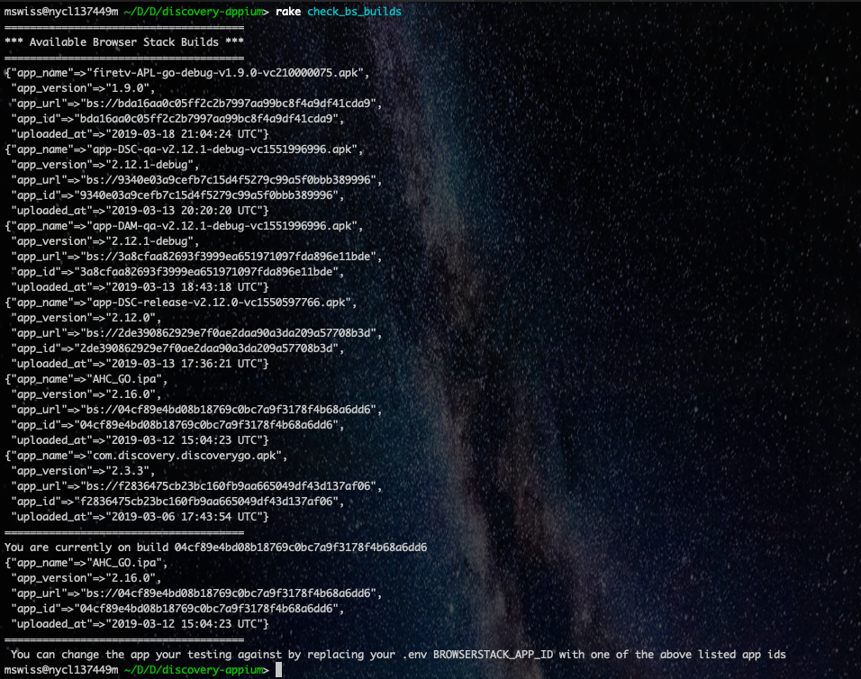
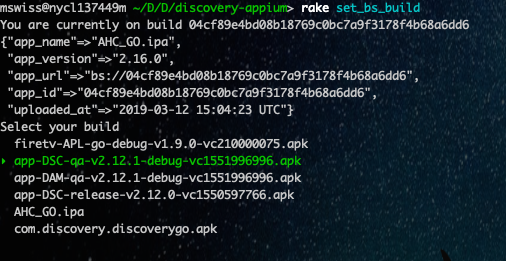
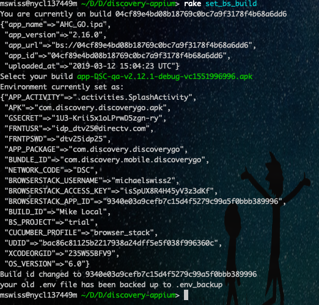

ReadMe 
-----
Installation
-----
1.) [Install Rvm](https://rvm.io/rvm/install)

2.) Use rvm to install and select ruby 2.5.1:
```bash
rvm install ruby-2.5.1
```
3.) Install bundler and bundle install:
```bash
gem install bundler
bundle install
```

4.) Copy `.env.shadow` to `.env` and fill out.
```bash
cp .env.shadow .env
vim .env
```
5.) Install [appium](https://github.com/discovery-digital/discovery-appium/wiki/Install-Guide---Android) and set up android dependencies

6.) Install [iOS specific dependencies](https://github.com/discovery-digital/discovery-appium/wiki/Install-Guide---IOS)


7.) You need a physical device or emulated device to run tests against.
For an emulated device:
- Install [android studio](https://developer.android.com/studio/)
- [Follow](https://developer.android.com/studio/run/emulator) googles documentation for setting up an emulated device
- Make sure it shows up when you run `adb devices`

For a physical device
- [Enable USB debugging](https://nishantverma.gitbooks.io/appium-for-android/executing_test_on_real_devices/) on your phone and connect it to your computer
- Make sure it shows up when you run `adb devices`
   

-----

 Running
-----
Locally:
-----

Before Running make Sure you have the `.apk` under test in the `features/support/builds` directory

Set `CUCUMBER_PROFILE="default"` in your `.env` file

To run ALL Cucumber tests:

```bash
cd legacy_ios
cucumber features/
```

Browserstack:
-----
#### Setup

Make sure your `.env` is filled out with `CUCUMBER_PROFILE="browser_stack"`

Make sure your `.env` is filled out with your browser stack username and access key 

```
BROWSERSTACK_USERNAME = "YOURS GOES HERE"
BROWSERSTACK_ACCESS_KEY = "YOURS GOES HERE"
```

`rake browser_stack:check_bs_builds` will let you check what build you are currently on and what is available on browserstack



You can change the build your testing against by updating the `XXXX_APP_ID` value in your .env file.  

**Please note that many builds are uploaded to browserstack with custom ids.**

This allows us to always test against the most recent dev/production build that have been uploaded to app center in our automation pipelines.  
The custom ids will be shown from the `browserstack:check_bs_builds` and should allow you some ability to set and forget which build your running against.

 
---
Running `rake browser_stack:set_bs_build` will allow you to change which build is set in your `.env` file.






Running these tasks will copy your old .env file to `.env_backup` unless you already have a backup file.


#### With Rake:

There are currently two rake tasks for android one to run legacy android tests and one to run native android tests.

There are currently two rake tasks for ios one to run legacy ios tests and one to run native ios tests

first run
`rake tasks:clean_log_directories`
to setup and clean report directories 

then run either

`rake legacy:android[discovery]` or `rake legacy:ios[discovery]` or `rake native:android[IDS]` or `rake native:ios[IDS]` or

rake atve:android or rake atve:ios or rake eurosports_black:android or rake eurosports_black:ios

To generate a report run 
`rake tasks:generate_report`


The output report will be in output/my_test_report.html

Rake tasks will mainly be used for jenkins runs so we can take advantage of parallelization and so that reports are generated.

Developing against browserstack
-----
[Browserstack App Live Guide](https://github.com/discovery-digital/discovery-appium/wiki/Browserstack---App-Live-Guide)

Further Reading
-----

Our [Wiki](https://github.com/discovery-digital/discovery-appium/wiki) contains more information in regards to best practices, setup guides etc.


